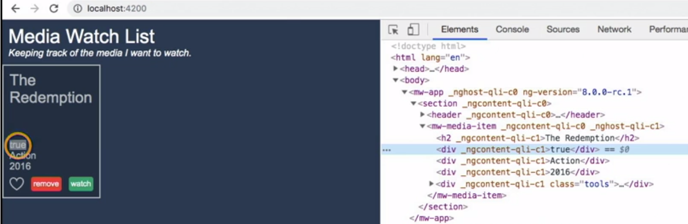
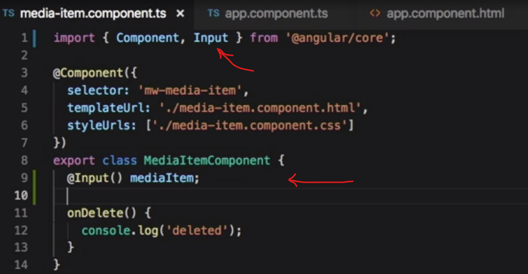
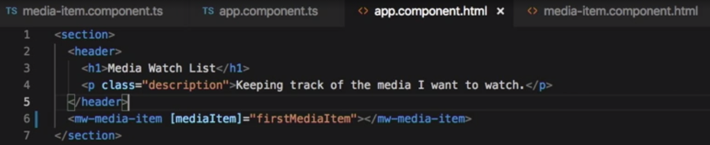

# ANGULAR

- Parts that you use to write applications in Angular:
  

## COMPONENTS

- Angular is built upon **_components_**.
- The starting point of an Angular app is the bootstrapping(like the HTML DOM tree) - Angular runs on a component tree model.
- After Angular loads the first component with the bootstrap call, it then looks within that component's HTML view and sees if it has any nested components.
- If so, Angular finds matches and runs the appropriate component code on those. This repeats for each component down the tree.
  
- _A component in Angular is used to render a portion of HTML and provide functionality to that portion_.
- It does this through a **_Component class_** in which you can define application logic for the component.
- For example, you can have a MediaItemComponent that can have a property named mediaItem that represents the data for a mediaItem.  
   And that component can also have a method called onDeleteClick that can handle raising the delete mediaItem event.  
   With each component in Angular, you can **_specify an HTML template_**, the markup that will get rendered. And through the use of the Component class and how Angular renders the component, you can display the data for the mediaItem property in your template.  
   And Angular provides an easy syntax, known as the **_template syntax_**, to wire up to DOM events within your template. So you can wire up the click event on a button to the onDeleteClick method.  
  

- You can even use **_components within components_**. This is where the component tree comes into play. You can build out your Angular apps by having components rendering components within their templates.
- Each component gets configured with a **_selector_**, which tells Angular what markup element tag to associate the Component class logic with. _When you build a component in Angular, you are creating support for a new custom element for the DOM_.
  <br/>

### NgModule and the Root Module

- Angular leverages **_decorators_** to help configure code like classes, methods, and fields.
- TypeScript provides support for decorators through its transpiler. The syntax for using a decorator is:  
  the @ symbol, followed by the decorator name, and then a pair of parentheses. -> `@Component()`  
- An Angular application starts with an **_Angular module_**, which gets configured using a decorator. An Angular modules help to keep application code organized by blocks of functionality and features.
- A **_root module_** acts as the starting point module for an Angular application.   
  Create the root module class in a file named app.module.ts, that is in the Source/App folder of the project.  
      
  Use a decorator to annotate that class so Angular will know it's an Angular module - **_`NgModule` decorator_**; import it using the module loading syntax that TypeScript supports. The NgModule decorator comes from the core scoped package in Angular.

```JavaScript
import { NgModule } from '@angular/core';
```

Now we can make use of the NgModule decorator; prefix it with the At symbol, then NgModule and a pair of parentheses.  
The NgModule decorator takes in an object with some known properties to configure the class you decorate as an Angular module. These properties are known as _metadata_. All of these can be set up as an array.

- The **_imports_** property is used to bring in other Angular modules that your module will need.
- The **_declarations_** property is used to make components, directives, and pipes available to your module that don't come from another module.
- The **_bootstrap_** property is used for a root module and will let Angular know which component or components will be the starting point for the bootstrap process. Basically, the entry point for your app code.  
- So from here, you follow it up with a class definition for the Angular module. Since this is going to be our app route module, let's name it **AppModule**. So we type class space AppModule and that up with a pair of curly braces. Since we are building this module in its own file and we want to import into another file, we need to provide support for using the module loading syntax. You do this by using the export keyword in front of the class keyword.  
```TypeScript
@NgModule({
  imports: [],
  declarations: [],
  bootstrap: []
})
export class AppModule {}
```  
- Since we are building a browser-based app, we want to make use of the **_browser module_** that the Angular platform has available.The browser module contains core directives, pipes, and more for working with the DOM, and can be found in the platform browser scoped package. Import the browser module and add the browser module to the array for the imports metadata property.

```TypeScript
import { BrowserModule } from "@angular/platform-browser";
```  
```TypeScript
@NgModule({
  imports: [BrowserModule],
  declarations: [],
  bootstrap: []
})
```  

- Our app is going to need a starting component - AppComponent (will be created later - this file will be located right next to the app.module.ts file. Import this component and add the app component to the declarations property, as it is a component that we want to make available to the Angular module.

```TypeScript
import { AppComponent } from "./app.component";
```

- Finally, we need to add the app component to the bootstrap property as well. Since this app module is being used as the root module, Angular will use the app component as a target for bootstrapping the app.

```TypeScript
@NgModule({
  imports: [BrowserModule],
  declarations: [AppComponent],
  bootstrap: [AppComponent]
})
```

<br/>

### Component metadata

- Building the first component (the app component). app -> app.component.ts  
  
- To build an angular component - import the component and use the **_component decorator_**; - export a class for the component.  
- The component decorator takes in a ***metadata object*** with some known properties to configure the class you decorate as an angular component.
- To decorate a component, you need to provide two metadata properties at a minimum.
  - **Selector** - is what angular will use to locate a custom html element and apply the component to.
  - **Template** or **template url** - Angular will use the template property content to fill the inner html of the targeted custom element when it processes it.

```JavaScript
import { Component } from "@angular/core";

@Component({
  selector: "app-root",
  template: "<h1>MyApp</h1>"
})
export class AppComponent {}
```  
<br/>

### Bootstrapping the module for the browser
- After creating a root module and a starting component, Bootstrap the module.
- Put the bootstrap logic in a separate file - Main.ts inside the app folder.
Angular has support for running on multiple platforms. For this app we are targeting the browser so we need to bootstrap for that platform. 
- Angular exports a function named ***```platformBrowserDynamic```*** that can be used for targeting the browser and that comes from the platform-Browser-Dynamic scope package. So we can import the platform-Browser-Dynamic function from there.
```JavaScript
import { platformBrowserDynamic } from '@angular/platform-browser-dynamic';
```  
- This function returns a platform object that has a bootstrap module function on it. That is the function you will use to bootstrap your root module on the platform.  
This function is expecting a root module and we have one already created from earlier named AppModule import it and pass the app module type into the bootstrap module function call.  
 ```JavaScript
 import { platformBrowserDynamic } from '@angular/platform-browser-dynamic';
 import { AppModule } from './app/app.module';
 
 platformBrowserDynamic().bootstrapModule(AppModule);
 ```  
- And with that we have all the initial starting bits written to get this Angular app up and running in the browser.  
  Let's open up a command line or terminal. I'll do that from within Visual Studio code here using the keyboard shortcut of control plus the tilde key to open up the terminal and I'll run the ```ngServe command``` from the Angular CLI to build and serve the application in watch mode where any changes made to the files in the application will trigger a rebuild and a refresh of the browser window automatically.  
  And over in the browser, we can see the content from the app component template is displayed.  
  

<br/>  

###  The Component Selector  
Angular will use the selector property from the component metadata to find a match in the Dom based on an element name.  
***Recap:***  
- Angular kicks off with the bootstrap call in the main.ts file, that takes in an Angular root module -  ```(AppModule)```.  
  *main.ts file:*  
```JavaScript
import { platformBrowserDynamic } from "@angular/platform-browser-dynamic";
import { AppModule } from "./app/app.module";

platformBrowserDynamic().bootstrapModule(AppModule);
```  
- And in the app.module.ts file, are a list of components to use as the starting component - ```bootstrap: [AppComponent]```.  
  *app.module.ts file:*  
```JavaScript
import { NgModule } from "@angular/core";
import { BrowserModule } from "@angular/platform-browser";
import { AppComponent } from "./app.component";

@NgModule({
  imports: [BrowserModule],
  declarations: [AppComponent],
  bootstrap: [AppComponent]
})
export class AppModule {}
```
- For Example: In the components file (app.components.ts), Angular will use the selector property ```selector: "app-root",``` from the component metadata to find a match in the DOM (index.html), based on an element name ```<app-root></app-root>```.  
  *app.component.ts:*  
```JavaScript
import { Component } from "@angular/core";

@Component({
  selector: "app-root",
  template: "<h1>MyApp</h1>"
})
export class AppComponent {}
```  
- Angular will bootstrap the AppComponent to that element.
The W3C spec states that custom DOM elements should use at least one dash in their names.  
<br/>

###  The component template  
When angular finds a match in the Dom for a component selector, it will render the component markup into that Dom element that it found a match on. The markup it will inject comes from the component metadata template properties. There are two options for this; template or template URL.  
This is an inline template. The markup is declared within the component metadata.  
  
The other metadata property we can use is the template URL. This property allows us to specify a file that contains the template content. Angular will load that template file for us and do the same content rendering. We can create a new file named app dot component dot HTML in the app folder to hold the template.  
  
Then we can go back to the app.component.ts file and change the template property to be **templateURL**. And set that equal to the relative path to the app.component.html file we just created.  
  

###  Styling a component  

We have the app component with its metadata configured for the selector and the template URL. Let's see what we can do about giving it some style. Angular provides support for styling a component via the component metadata in two ways similar to how templates work. We can use either the **styles** property, or the **styleUrls**s property, both take an array of string values.
  

###  Using other components in a component  
Add a new component named media-item.component.ts. This thing will be used to display the details of a media item and we want to use it from within the app component. If we take a look at this new file, we can see the import and component decorator along with the component metadata object literal we have learned about to this point.  
Let's get this added to the app module so it knows it is available for use in other templates.  
  
Over in the **app.module.ts** file where we have the AppModule class, we want to add the new media item component to the declarations and metadata property.  
- first add the import statement for that.  
- then add the media item component to the declarations array.  
    
- Now we can switch over to the app.component.html and add a DOM element named mw-media-item element.  
    
If we head over to the browser, we can see that the media-item component is rendering. And if we inspect the source for the DOM, we can see that the media item component template markup has been rendered inside of the mw-media-item element.  


###  Interpolation and the expression context  
Interpolation is a way to get data displayed in the view.  
You do Interpolation by using a pair of matching curly braces in the markup. And the contents of the double curly braces is a JavaScript like expression that Angular will evaluate and then convert to a string. So we can add a pair of curly braces in the h tag for the media item name and put an expression like 10 + 5, and see in the browser that Angular evaluates that to 15 and renders it as a string of content in our h tag.  
But not all expressions are supported. Assignments, newing up variables, expressions that are chained, and incrementors and decrementors are not valid template expressions.  
*EXAMPLE:*- add a class property and assign it a string value; add a method wasWatched() and have it return true. Flip over to the template file and use the property and method inside html tags with curly braces.  
  
```HTML
	<h2>{{ name }}</h2>
	<div>{{ wasWatched }}</div>
```  
Here in the browser we see what is being rendered:  
  

###  Property binding  
Another way you can bind data in templates with Angular is through property binding. HTML elements have backing DOM properties that track state on elements. You can use Angular's property binding syntax to wire into those properties.  
  

###  Event binding  
The event binding templates syntax in Angular allows you to wire up event handlers from within your component templates. You can wire up native Dom element events, as well as custom events you create for your components to emit.  
Notice that we use the term click here and not on click. Angular has a pattern for native Dom events where it is looking for the event name without the on.  
  
  

###  Getting data to the component with @Input  

You can define properties for components you create and make them available to be set via the property binding syntax by using an Angular decorator named Input. Let's refactor the MediaItemComponent to move away from the static content and support sending it a media item to display.  
- We start with the media-item.component.ts file. We need to *import the Input decorator to use it*. This comes from the angular/core scoped package.  
- The Input decorator is designed to be used on a class property. Let's create a new class property on the MediaItemComponent class named mediaItem, and we'll decorate it with the Input decorator - ```@Input() mediaItem;```. This will tell Angular that we want it to support any property bindings placed on instances of the mw-media-item elements where the property name is mediaItem.  
  
- Let's switch over to the app.component.ts file and make *use of the new Input property*. Update the AppComponent class to give it a firstMediaItem property set to an object literal with some sample data. We want to send this to the mw-media-item element.  
  
- Switch over to the app.component.html file. And in here, we can use the property binding syntax with our Input name from the MediaItemComponent. We use the square brackets and add mediaItem, and then we set that equal to the AppComponent property of firstMediaItem.  
  
the ```[mediaItem]```, which is the Input property from the MediaItemComponent, is the binding target. The ```firstMediaItem``` property from the AppComponent is the binding source.  
*The DOM has built in properties on existing elements. Components you create do not. That is why the Input decorator is used to give components properties that you want to expose for use when using the component*.  
- Now, if we flip over to the media-item-component.hmtl file, we can replace the static Name, Watched on date, Category, and Year text with some interpolation syntax.  
  
Looking at this in the browser, we can see the mediaItem data rendered within the mediaItem content.  
The Input decorator supports passing in an alias name in the parentheses if you wish to expose the property name for use to be something different than the class property name. For example, we could switch over to the media-item.component.ts file and add the string literal mediaItemToWatch into the Input decorator parentheses,  
  

and then switch over to the app.component.html file where we are using it and update the property name to be mediaItemToWatch instead of mediaItem in the binding target. *Now, even though Angular supports this name alias, it is a recommended practice to avoid using that approach by default*.  


## DIRECTIVES and PIPES

#### Component

Components are actually directives with a template. _Directives provide functionality and can transform the DOM._

- Structural Directives - modify layout by altering elements in the DOM.
- Attribute directives - change the behavior or appearance of an existing DOM element.  
  You can applying directives to an existing element, or a template element, to change that element in some way.  
    
  Like a component, a directive gets configured with a selector that Angular will use to find a match and apply the directive.  
  You apply a directive in different ways. You can write an attribute on an element that matches your selector,  
  or you can use the template syntax to add a directive and an assignment statement.  
    
  In addition to creating your own directives Angular comes with a number of directives out of the box to handle common web app constructs by conditionally rendering elements based on some expression1(`ngIf`), looping out items to render(`ngFor`), or even for things like router links (`routerLink`).

#### Pipe

Another tool in the Angular toolbox to display content is the pipe. A **_pipe_** takes in data, like a string or an array, and runs some logic to transform it to a new output.  
Angular comes with some common pipes like date, and uppercase and lowercase.  
You can also write your own pipes.  
_Pipes are a great way to change data in a reusable way without having to imbed the transformed logic within component classes. And without having to modify the data just for display purposes_.

### Data Binding

- You can bind data to views and work with data in those views via **_interpolation_**, - `<h1>{{ movie.title}}</h1>`.
- You can also use directives to help display data. Use the **_template syntax_** in Angular to work with data in views.  
  You can wire up click events to DOM elements that modify data that you've displayed elsewhere and Angular will handle the update of that data visually.

There are many elements to the template syntax.

- interpolation and built-in directives
- constructs and patterns
  - Template expressions and statements
  - Value binding - binding syntax for property, attribute, class, and style bindings
  - Event binding
  - Template expression operators.

You can also create and use local template variables created in markup using the hash to get a reference to the element and then use that from any sibling or child element in the view.

This allows you to wire up simple interactions or display related data from within your markup without needing to write any script code.  


- Now when it comes to collecting data from the user, Angular has a form module loaded with directives and services for helping you build HTML forms.  
  It provides:
  - data binding for both setting and getting data
  - change tracking
  - validation
  - error handling

### Dependency injection

- Angular brings dependency injection to JavaScript.
- **_Dependency injection (DI)_** is the concept of _inversion of control (IoC)_, where you architect code in a way that you provide modules with other modules it needs to get some work done.
- DI allows you to write decoupled code that is easier to unit test and to work with.
  
- You can write modular components, and services and tell Angular what/where you want to use them.
  
- The most common place you use DI is in your class constructors.
  - components
  - directives
  - pipes
  - services
- You can declare types on your constructor parameters with TypeScript.
- You can also leverage DI through
  - component metadata,
  - properties, for directives and providers.
- You can even do some DI at the bootstrap phase of an Angular app, setting up your dependency graph when your app starts up, and getting that delivered through all aspects of your app.
- You can replace a dependency at any phase of application code.

### Services and other Business Logic

- _Services in Angular are more of an implied pattern_. A JavaScript class or function that is encapsulated is refered to as a service in Angular.
- Put application business logic in services.  
  **_Example:_**  
  You can write a JavaScript class that handles finding the record data and returning it as an object. This would be a service. And then, using Angular's DI framework, you can specify that a component is going to use this service. And from within the component logic, you can request the a data record from your service and make it available to your view template.
- These services that you write can also leverage DI, so you can create constructors and specify parameter types, with the help of some TypeScript, and Angular will provide your service instance with the appropriate dependencies.

### Data Persistence

Persist data from JavaScript in the client is handled in a couple of different ways with Angular

1. In-Memory Data Store - storing data for the time in which the user is using your application, you could store that data in memory.
   Create a JavaScript class or object to store your data, provide it to your app as something that can be injected in, and then do constructor injection where needed to bring in the instance of that object.
2. Local Storage Service - Write your own JavaScript code to do so and then use it with the services pattern, leveraging Angular's dependency injection to work with it throughout your application.
3. Data Store Service - One way you can persist data to and from an API is by leveraging the HTTP protocol. You can do this in two ways. One, by using the XML HTTP request, or XHR, and the other by using JSONP. Angular provides an HTTP module in the framework for abstracting out working with the way XHR and JSONP calls are done via client script.

### Routing

Angular provides a router module that handles routing on the client and adjusts the UI and data displayed accordingly.
This Router Module supports:

- Route configuration to components, route params to have variables in the URL;
- Routing links - a directive for working with links that do routing;
- Router outlets - a dircetive for specifying where in a template the routed component will display, creating child routes;
- Routing events - rougting lifecycle hooks for responding routing events;
- It also handles history state, altering the way a browser handles it by default, so that back and forward actions by the user will result in Angular route changes.
