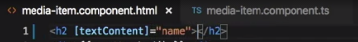
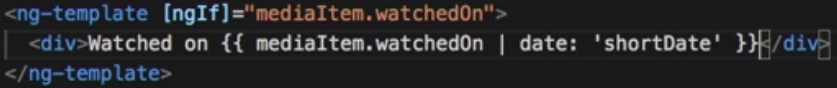
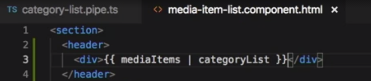
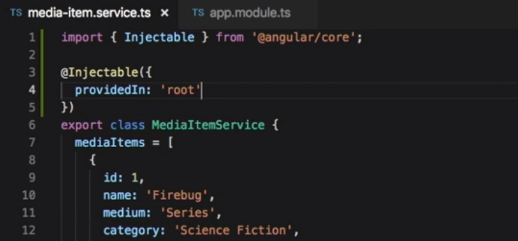

# ANGULAR

- Parts that you use to write applications in Angular:
  

## COMPONENTS

- Angular is built upon **_components_**.
- The starting point of an Angular app is the bootstrapping(like the HTML DOM tree) - Angular runs on a component tree model.
- After Angular loads the first component with the bootstrap call, it then looks within that component's HTML view and sees if it has any nested components.
- If so, Angular finds matches and runs the appropriate component code on those. This repeats for each component down the tree.
  
- _A component in Angular is used to render a portion of HTML and provide functionality to that portion_.
- It does this through a **_Component class_** in which you can define application logic for the component.
- For example, you can have a MediaItemComponent that can have a property named mediaItem that represents the data for a mediaItem.  
   And that component can also have a method called onDeleteClick that can handle raising the delete mediaItem event.  
   With each component in Angular, you can **_specify an HTML template_**, the markup that will get rendered. And through the use of the Component class and how Angular renders the component, you can display the data for the mediaItem property in your template.  
   And Angular provides an easy syntax, known as the **_template syntax_**, to wire up to DOM events within your template. So you can wire up the click event on a button to the onDeleteClick method.  
  

- You can even use **_components within components_**. This is where the component tree comes into play. You can build out your Angular apps by having components rendering components within their templates.
- Each component gets configured with a **_selector_**, which tells Angular what markup element tag to associate the Component class logic with. _When you build a component in Angular, you are creating support for a new custom element for the DOM_.
  <br/>

### NgModule and the Root Module

- Angular leverages **_decorators_** to help configure code like classes, methods, and fields.
- TypeScript provides support for decorators through its transpiler. The syntax for using a decorator is:  
  the @ symbol, followed by the decorator name, and then a pair of parentheses. -> `@Component()`  
- An Angular application starts with an **_Angular module_**, which gets configured using a decorator. An Angular modules help to keep application code organized by blocks of functionality and features.
- A **_root module_** acts as the starting point module for an Angular application.   
  Create the root module class in a file named app.module.ts, that is in the Source/App folder of the project.  
      
  Use a decorator to annotate that class so Angular will know it's an Angular module - **_`NgModule` decorator_**; import it using the module loading syntax that TypeScript supports. The NgModule decorator comes from the core scoped package in Angular.

```JavaScript
import { NgModule } from '@angular/core';
```

Now we can make use of the NgModule decorator; prefix it with the At symbol, then NgModule and a pair of parentheses.  
The NgModule decorator takes in an object with some known properties to configure the class you decorate as an Angular module. These properties are known as _metadata_. All of these can be set up as an array.

- The **_imports_** property is used to bring in other Angular modules that your module will need.
- The **_declarations_** property is used to make components, directives, and pipes available to your module that don't come from another module.
- The **_bootstrap_** property is used for a root module and will let Angular know which component or components will be the starting point for the bootstrap process. Basically, the entry point for your app code.  
- So from here, you follow it up with a class definition for the Angular module. Since this is going to be our app route module, let's name it **AppModule**. So we type class space AppModule and that up with a pair of curly braces. Since we are building this module in its own file and we want to import into another file, we need to provide support for using the module loading syntax. You do this by using the export keyword in front of the class keyword.  
```TypeScript
@NgModule({
  imports: [],
  declarations: [],
  bootstrap: []
})
export class AppModule {}
```  
- Since we are building a browser-based app, we want to make use of the **_browser module_** that the Angular platform has available.The browser module contains core directives, pipes, and more for working with the DOM, and can be found in the platform browser scoped package. Import the browser module and add the browser module to the array for the imports metadata property.

```TypeScript
import { BrowserModule } from "@angular/platform-browser";
```  
```TypeScript
@NgModule({
  imports: [BrowserModule],
  declarations: [],
  bootstrap: []
})
```  

- Our app is going to need a starting component - AppComponent (will be created later - this file will be located right next to the app.module.ts file. Import this component and add the app component to the declarations property, as it is a component that we want to make available to the Angular module.

```TypeScript
import { AppComponent } from "./app.component";
```

- Finally, we need to add the app component to the bootstrap property as well. Since this app module is being used as the root module, Angular will use the app component as a target for bootstrapping the app.

```TypeScript
@NgModule({
  imports: [BrowserModule],
  declarations: [AppComponent],
  bootstrap: [AppComponent]
})
```

<br/>

### Component metadata

- Building the first component (the app component). app -> app.component.ts  
  
- To build an angular component - import the component and use the **_component decorator_**; - export a class for the component.  
- The component decorator takes in a ***metadata object*** with some known properties to configure the class you decorate as an angular component.
- To decorate a component, you need to provide two metadata properties at a minimum.
  - **Selector** - is what angular will use to locate a custom html element and apply the component to.
  - **Template** or **template url** - Angular will use the template property content to fill the inner html of the targeted custom element when it processes it.

```JavaScript
import { Component } from "@angular/core";

@Component({
  selector: "app-root",
  template: "<h1>MyApp</h1>"
})
export class AppComponent {}
```  
<br/>

### Bootstrapping the module for the browser
- After creating a root module and a starting component, Bootstrap the module.
- Put the bootstrap logic in a separate file - Main.ts inside the app folder.
Angular has support for running on multiple platforms. For this app we are targeting the browser so we need to bootstrap for that platform. 
- Angular exports a function named ***```platformBrowserDynamic```*** that can be used for targeting the browser and that comes from the platform-Browser-Dynamic scope package. So we can import the platform-Browser-Dynamic function from there.
```JavaScript
import { platformBrowserDynamic } from '@angular/platform-browser-dynamic';
```  
- This function returns a platform object that has a bootstrap module function on it. That is the function you will use to bootstrap your root module on the platform.  
This function is expecting a root module and we have one already created from earlier named AppModule import it and pass the app module type into the bootstrap module function call.  
 ```JavaScript
 import { platformBrowserDynamic } from '@angular/platform-browser-dynamic';
 import { AppModule } from './app/app.module';
 
 platformBrowserDynamic().bootstrapModule(AppModule);
 ```  
- And with that we have all the initial starting bits written to get this Angular app up and running in the browser.  
  Let's open up a command line or terminal. I'll do that from within Visual Studio code here using the keyboard shortcut of control plus the tilde key to open up the terminal and I'll run the ```ngServe command``` from the Angular CLI to build and serve the application in watch mode where any changes made to the files in the application will trigger a rebuild and a refresh of the browser window automatically.  
  And over in the browser, we can see the content from the app component template is displayed.  
  

<br/>  

###  The Component Selector  
Angular will use the selector property from the component metadata to find a match in the Dom based on an element name.  
***Recap:***  
- Angular kicks off with the bootstrap call in the main.ts file, that takes in an Angular root module -  ```(AppModule)```.  
  *main.ts file:*  
```JavaScript
import { platformBrowserDynamic } from "@angular/platform-browser-dynamic";
import { AppModule } from "./app/app.module";

platformBrowserDynamic().bootstrapModule(AppModule);
```  
- And in the app.module.ts file, are a list of components to use as the starting component - ```bootstrap: [AppComponent]```.  
  *app.module.ts file:*  
```JavaScript
import { NgModule } from "@angular/core";
import { BrowserModule } from "@angular/platform-browser";
import { AppComponent } from "./app.component";

@NgModule({
  imports: [BrowserModule],
  declarations: [AppComponent],
  bootstrap: [AppComponent]
})
export class AppModule {}
```
- For Example: In the components file (app.components.ts), Angular will use the selector property ```selector: "app-root",``` from the component metadata to find a match in the DOM (index.html), based on an element name ```<app-root></app-root>```.  
  *app.component.ts:*  
```JavaScript
import { Component } from "@angular/core";

@Component({
  selector: "app-root",
  template: "<h1>MyApp</h1>"
})
export class AppComponent {}
```  
- Angular will bootstrap the AppComponent to that element.
The W3C spec states that custom DOM elements should use at least one dash in their names.  
<br/>

###  The component template  
When angular finds a match in the Dom for a component selector, it will render the component markup into that Dom element that it found a match on. The markup it will inject comes from the component metadata template properties. There are two options for this; template or template URL.  
This is an inline template. The markup is declared within the component metadata.  
  
The other metadata property we can use is the template URL. This property allows us to specify a file that contains the template content. Angular will load that template file for us and do the same content rendering. We can create a new file named app dot component dot HTML in the app folder to hold the template.  
  
Then we can go back to the app.component.ts file and change the template property to be **templateURL**. And set that equal to the relative path to the app.component.html file we just created.  
  

###  Styling a component  

We have the app component with its metadata configured for the selector and the template URL. Let's see what we can do about giving it some style. Angular provides support for styling a component via the component metadata in two ways similar to how templates work. We can use either the **styles** property, or the **styleUrls**s property, both take an array of string values.
  

###  Using other components in a component  
Add a new component named media-item.component.ts. This thing will be used to display the details of a media item and we want to use it from within the app component. If we take a look at this new file, we can see the import and component decorator along with the component metadata object literal we have learned about to this point.  
Let's get this added to the app module so it knows it is available for use in other templates.  
  
Over in the **app.module.ts** file where we have the AppModule class, we want to add the new media item component to the declarations and metadata property.  
- first add the import statement for that.  
- then add the media item component to the declarations array.  
    
- Now we can switch over to the app.component.html and add a DOM element named mw-media-item element.  
    
If we head over to the browser, we can see that the media-item component is rendering. And if we inspect the source for the DOM, we can see that the media item component template markup has been rendered inside of the mw-media-item element.  


###  Interpolation and the expression context  
Interpolation is a way to get data displayed in the view.  
You do Interpolation by using a pair of matching curly braces in the markup. And the contents of the double curly braces is a JavaScript like expression that Angular will evaluate and then convert to a string. So we can add a pair of curly braces in the h tag for the media item name and put an expression like 10 + 5, and see in the browser that Angular evaluates that to 15 and renders it as a string of content in our h tag.  
But not all expressions are supported. Assignments, newing up variables, expressions that are chained, and incrementors and decrementors are not valid template expressions.  
*EXAMPLE:*- add a class property and assign it a string value; add a method wasWatched() and have it return true. Flip over to the template file and use the property and method inside html tags with curly braces.  
  
```HTML
	<h2>{{ name }}</h2>
	<div>{{ wasWatched }}</div>
```  
Here in the browser we see what is being rendered:  
  

###  Property binding  
Another way you can bind data in templates with Angular is through property binding. HTML elements have backing DOM properties that track state on elements. You can use Angular's property binding syntax to wire into those properties.  
  

###  Event binding  
The event binding templates syntax in Angular allows you to wire up event handlers from within your component templates. You can wire up native Dom element events, as well as custom events you create for your components to emit.  
Notice that we use the term click here and not on click. Angular has a pattern for native Dom events where it is looking for the event name without the on.  
  
  

###  Getting data to the component with @Input  

You can define properties for components you create and make them available to be set via the property binding syntax by using an Angular decorator named Input. Let's refactor the MediaItemComponent to move away from the static content and support sending it a media item to display.  
- We start with the media-item.component.ts file. We need to *import the Input decorator to use it*. This comes from the angular/core scoped package.  
- The Input decorator is designed to be used on a class property. Let's create a new class property on the MediaItemComponent class named mediaItem, and we'll decorate it with the Input decorator - ```@Input() mediaItem;```. This will tell Angular that we want it to support any property bindings placed on instances of the mw-media-item elements where the property name is mediaItem.  
  
- Let's switch over to the app.component.ts file and make *use of the new Input property*. Update the AppComponent class to give it a firstMediaItem property set to an object literal with some sample data. We want to send this to the mw-media-item element.  
  
- Switch over to the app.component.html file. And in here, we can use the property binding syntax with our Input name from the MediaItemComponent. We use the square brackets and add mediaItem, and then we set that equal to the AppComponent property of firstMediaItem.  
  
the ```[mediaItem]```, which is the Input property from the MediaItemComponent, is the binding target. The ```firstMediaItem``` property from the AppComponent is the binding source.  
*The DOM has built in properties on existing elements. Components you create do not. That is why the Input decorator is used to give components properties that you want to expose for use when using the component*.  
- Now, if we flip over to the media-item-component.hmtl file, we can replace the static Name, Watched on date, Category, and Year text with some interpolation syntax.  
  
Looking at this in the browser, we can see the mediaItem data rendered within the mediaItem content.  
*Note*: The Input decorator supports passing in an alias name in the parentheses if you wish to expose the property name for use to be something different than the class property name. For example, we could switch over to the media-item.component.ts file and add the string literal mediaItemToWatch into the Input decorator parentheses,  
  
and then switch over to the app.component.html file where we are using it and update the property name to be mediaItemToWatch instead of mediaItem in the binding target. *Now, even though Angular supports this name alias, it is a recommended practice to avoid using that approach by default*.  


###  Subscribing to component events with @Output  
Angular has an output decorator that allows you to expose event bindings on components. We can update the media item component and make use of the output decorator to provide notifications of a delete request. Using output is similar to how you use input.  
- First we need to import the output decorator from the @angular/core scoped package.  
- Then we can use the output decorator to decorate a property on the component class, that we can name "delete."  
  Like the input decorator, the output decorator allows you to pass in a string value if you want to alias the property. But again, *it is recommended you only use the alias if you run into a case where you need it*. So we will stick with the property name of "delete" here.    
  
*The difference with output is we want to set the property to an EventEmitter object*.  
- To do that, we need to import the *EventEmitter*, which also comes from the @angular/core scoped package.  
- And then back down at the new property, we can set that equal to a new EventEmitter.  
- The delete property, which is an EventEmitter, has a method named "emit." So we call this.delete.emit. This method expects to be called with an argument that represents data we can send back.  
  
And with that, the media item component is now wired up with an output for a delete event, using the output decorator.  
- The last thing we need to do is to head over to the app component, where we are using the media item component, and make use of the event.  
So over in the app.component.html file, we can add the delete event binding to the mw-media-item element. Create a call to an ```onMediaItemDelete``` method. And since this emit callback in the media item component was being called with the media item as an argument, we can make use of a key term, ```$event```, in the statement, to get access to that value.  
So this is us in the app component telling Angular, "Hey, when this media item component emits its delete event, we want to respond to that by calling the app component onMediaItemDelete method."  
  
- One last thing. We need to flip over to the app.component.ts file, and add our ```onMediaItemDelete``` method. We know that the event from the media item component will return us a media item object, so we can add a parameter named mediaItem to the signature. Here you can fill out this method with the logic to delete a media item.  
  


## DIRECTIVES and PIPES

###  Structural directives: ngIf  

Angular has two types of directives:  
 - structural - a structural directive is designed to alter the DOM layout by adding or removing DOM elements. 
 - attribute.  
Let's start with the Angular structural directive **ngIf**. ngIf will conditionally render the DOM element that the directive is on. Structural directives are applied to normal DOM elements using an asterisk template syntax.  
In this case, we want to see if mediaItem.watchedon has a value.  
  
Let's talk about that asterisk syntax. The asterisk is what is referred to as syntactic sugar. Syntactic sugar is a shorthand pattern for writing something that the platform will interpret and convert to the actual syntax. So back in the code we can actually rework the way we use ngIf here:  
  
The asterisk syntax allows you to skip having to write the ng-template tag and simply put the structural directive directly on the element that is the contents of the ng-template. Note that both ways work the same.  
But there are times where using the ng-template element for your ngIf is handy, like when you want to conditionally render multiple sibling elements based on the same conditional statement and not introduce another DOM element to do so.  


###  Structural directives: ngFor  

The ngFor directive is used to repeat markup when looping over some data.  
Let's put the ngFor to use in the app. We have another new component named media-item-list-component.ts. This component is designed to render out a list of media items and uses the media item component to render each one.  
  
In the template markup there is a section element with one mw-media-item element inside of that. We want to have a ```<mv-media-item>``` element **for each** media item in the media items, class property.  
We can now use the media item template input variable by putting the media item property binding on the ```<mv-media-item>``` element and setting the statement to the media item, template, input variable.   
  
And now if we look at the browser we see the list of media items. And if we inspect the list, we can see that the media dash item elements are written out to the DOM. Out of the box, these structural directives not only handle modifying the DOM when they first load up but they also adjust the Dom as the data that is bound changes.  
  


###  Attribute directives: Built-in  
Attribute directives are designed to change the appearance or behavior of the DOM elements that they are attached to. They do not create or remove DOM elements like structural directives.  
- Set up some CSS rules set up in the media-item.component.css file for some classes. So we can just start using those in the template. So on the mw-media-item element, we use the directive property template syntax using the square brackets around the term ngClass, and set that equal to a statement.  
- In the media-item-list.component.html file, we will make use of the ngClass attribute directive to get some CSS classes onto the mediaItem elements based on the mediaItem medium type.  
  The ngClass directive expects an object structure for its statement value with the CSS classes for the property names and a true false for the values. In our case, we want to have two CSS classes, one named ```medium-movies``` and one named ```medium-series```.  
    
  and set the value of medium-movies and the value of medium-series.  
    
- And if we switch over to the browser, we see different colors for the media items. And if we inspect the DOM, we can see that the media items are getting the appropriate class applied to them from the ngClass attribute directive.  
    


###  Attribute directives: Custom  

This attribute directive will handle setting a class on the media item element. If it has been set to a favorite or not.
- Create a new file inside the app folder named favorite.directive.ts And in there we bring in the directive decorator with an import statement from the angular core scoped package.  
- Then we use the @directive decorator and pass it in object literal for the directive metadata. The selector value is going to be ```[myFavorite]```.  
- we need to export a class named ```FavoriteDirective```.  
- To get a class applied to the host element that the directive is on, use another angular decorator called host binding and is found in the angular core scoped package. So we add host binding to the import statement.  
- Host binding is used to bind a host element property to a directive property. So inside of the director of class definition, we add ```@HostBinding()```; and  nside of the parentheses we put ```@HostBinding('Class.is-favorite')```. Name ```@HostBinding('Class.is-favorite')``` and initialize that to ```true``` for now. So the host binding decorator is configuring.  
    
- Now we can switch over to the media-item.component.html file and put the directive property on the element for the favorite icon.  
    
- The last thing we need to do is let the app module know that this new directive is available for use. Over in the app.module.ts file. We want to add this new directive to the declarations of metadata property.  
    
- Over in the browser, we can inspect a media item and see the is- favorite CSS class apply to the element we put the directive on.  
    


###  Using directive values  

Here's how you can make your custom directive support input values from the directive property that matches the directive selector on the host element.  
- wrap the MW favorite with brackets to let Angular know we want to do the binding here; and set the directive property to ```mediaitem.isfavorite```.  
    

- let's switch over to the favorite.directive.ts file. And, in here, we need to add the input type into the import statement for the Angular core scoped package.  
- This time around, let's checkout another way you can use the input decorator.  
  You can also use it to decorate a class setter method. Now, a setter method is a way of defining a method that will be called when a property with the same name is set to a value from an instance of the class. A setter method will get past a value so we can add a parameter named value here. Based on this code, Angular will match a property binding with the name mwFavorite, evaluate the statement that it is set to and pass the result of that statement into this setter method.  
    
- And if we switch over to the browser, we can inspect the media items and see that some get the class is favorite and some don't, based on their mediaitem.isfavorite data property.
    


###  Working with events in directives  
Directives can not only handle changing host element properties via host bindings, but they can also be set up to respond to host element events via host listeners.  
- over in the favorite.directive.ts file, Let's add some hosts listeners to toggle on and off a CSS class, ```is-favorite-hovering```.  
Angular provides another decorator for handling wiring up to host element events. The **host listener decorator**.  
- Host listener is found in the angular core scoped package; add that to the import statement.  
- add another host binding for the ```is-favorite-hovering``` CSS class; and let's use add a property named hovering, setting it to a default value of false.  
- We will toggle this value from mouse hover events to handle adding or removing the CSS class. Okay, let's add some host listeners. We want to listen for the on mouse inter event on the host element.  
- We also want to listen for on mouse leave. So we add another host listener decorator passing it mouse leave. And decorate a function that we can name on mouse leave. And in this function, we set this dot hovering to false.  
    
- Then over in our browser, we can inspect the media item and then mouse-over and off of the favorite icon and see the class getting applied and removed.
    

###  Angular pipes: Built-in  
An Angular Pipe is a template expression operator that does display value transformations. They are designed to be used in interpolation syntax and template statements within component template markup. The general idea being that you use a pipe after your statement that you wish to transform And the pipe will run on that statement value and return a final value that the template will display. 
- Let's see how we can use the Angular date pipe to format a display - use the pipe template expression operator after the mediaItem.watchedOn statement and follow the pipe with the term date.  
    
If we switch over to the browser, we can see the date value is now formatted.  
    
Here the date pipe is expecting a string parameter.    
    
  You separate each parameter by a colon.  
    
  Pipes can also be chained.  
    
Let's go back to the code and add the slice pipe to the mediaItem.name output and use it to only show a max length of characters. The slice pipe takes a start position and a length. So we pipe mediaItem.name into slice and then add a colon and then the number 0, then another colon and the number 10. Over in the browser, we see the longer names have been truncated. Pipes can also be chained. Back in the code, let's add the uppercase pipe to the mediaItem.name output. So this is sending name into slice and slice is returning a transformed value which is then sent to uppercase, which returns the final value to the interpolation statement. Over in the browser, we can see the results. Let's go back to the code and do some final plumbing. And just remove the pipes on the name now that we've seen how we can chain them. 


###  Angular pipes: Custom  

Let's build a custom pipe for the application that will display a list of all the unique media item categories for the media items currently displayed on the screen.   
- We start by creating a new file named category-list.pipe.ts in the app folder.  
- We need to use the pipe decorator which is in the Angular core scoped package.  
- Add the pipe decorator - accepts an object of metadata - name and pure
- add export class CategoryListPipe.  
- Next we need to implement a transform method. We can make use of a TypeScript interface here to help enforce this usage. The pipe transform interface. Let's import that from Angular core as well. 
- And then we can use the key word implement after the class name and then a space and then the pipe transform interface.  
- With that in place, we can create a class method named ```transform```; add a parameter named mediaItems. The parameter name can be whatever we want. Only the method name has to be what Angular is expecting.  
- Okay, now we can fill out the logic of the transform method.  
  We want to get all the distinct category names across all media items passed in.  
    
- Okay, let's use the new pipe we created. In the media-item-list.component.html file, let's add a header element. And in there, let's add a div with the interpolation syntax of double curly braces mediaItems. Then add the pipe character, followed by the name we use for the category list pipe decorator metadata, categoryList.  
       
- The last step we need to do, is tell Angular to add our custom pipe to the app.module.ts. - add an import statement to bring in the ```CategoryListPipe``` type. And then add the type to the declaration's metadata property array.  
    
Now, if we head over to the browser, we can see the list of unique categories rendered from the custom pipe.  
    
  


##  Forms  

###  Angular forms  

There are two common approaches to building forms in Angular: **template driven**, where the majority of the form logic is crafted in the template markup, and **model driven**, where the majority of the form logic is crafted in the component class.  

###  Template-driven forms  

To make use of the forms module, you need to add it to the list of imports for your angular module. In the app.module.ts file, we can add a new import statement and bring in the forms module from the angular forms scoped package. Then we can add the forms module to the imports metadata property array.  
    

- Set up a new component -  immediate-item-form.components 
- wire up the app module and app component.
- switch over to the media-item-form.component.html file. In angular the template driven approach to building forms makes use of the template syntax to build form interactions all within your template markup.  
  - With the forms module included in the app angular is going to be on the lookout for any form elements in your templates. It does this through the builtin ```ngModel``` directive which has form as part of its selector value. But you do need to tell it what fields are going to be part of the form.  
  - On the medium HTML select element, lets add the directive NG model.  
  - On the form element, add an event binding using the parentheses around NG submit and set it equal to a function call that we will create of on submit.  
  - On the form element, to capture a handle to this form that angular creates, use the hash and a name we want and pass in the value of the form to the on submit method, by using media item form.value.  
    
- And then over in the media-item-form.component.ts file, we can add the on submit method, naming the parameter media item.  
    
  - go back to the template file, and add in the rest of the ngModel directives on the other form fields. And then switching back to the browser, we can fill out the form fields with some test data, then we can submit, and see the form model has the data structure we want.
    
- And then switching back to the browser, we can fill out the form fields with some test data, then we can submit, and see the form model has the data structure we want.  
    


###  Model-driven forms  

The model-driven or reactive approach is another way to handle building forms in Angular. The difference is the form is built in the component class. That allows you to have a contract that your form needs to adhere to, the ability to set up validation rules, subscribed to field value changes and ultimately unit tests your form logic without any UI layer.  

- model-driven forms are built using the ReactiveForms module instead of the FormsModule. We need to update the app module to import and use that instead of FormsModule.  
    
- in the media-item-form.component.ts file, we are going to create a FormGroup object that represents the form - import ```{ FormGroup }```.
- We need a class property for the form. So let's add that naming it form. We can also use some TypeScript here to declare the type by adding a colon, then the FormGroup type then a semi-colon.  
- Next initialize the form property to a new form group. We will do this in an Angular lifecycle method called ```ngOnInit```. While we could put this in the constructor, it is preferable to use the lifecycle events because it makes the code easier to unit test.  
  - add ```OnInit``` to the import statement from Angular core  
  - then add ```implements OnInit``` after the class name.  
  - Then we can add an ```ngOnInit``` method.  
  - And in the function body we set ```this.form = new FormGroup();```.  
  FormGroup expects to be called with an object structure that has properties named for the controls that will be in the group set to a value of a new control.  
  - import ```FormControl```. so we can new up some controls.  
  - And then in the parentheses for FormGroup recreate an object literal and we set up the form fields as property names and setting their value equal to a new FormControl object. FormControl can take in a default value as the first argument call. So we can set the medium to default to movies and set the rest of the default to empty strings.  
    
- flip over to the media-item-form.component.html file and tell Angular that we have a model for the form - ```[formGroup]="form"```.
-  And then in the onSubnit call we can call .value of form instead - ```(ngSubmit)="onSubmit(form.value)"```.
- wire up the form fields to the appropriate controls from the formGroup.  
    
With all those wired up, if we head over to the browser we can see that the form has a default value for medium of movies like we configured and if we fill out the form we see the same expected behavior in the console log.  


###  Validation: Built-in  
- We add ```Validators``` to the import list at the top
- and down in the new form group method object we can set validators on the form controls.  
    
And we can switch to the browser, give the name field a value with an invalid pattern and if we inspect the name field in the dev tools, we can see that Angular is applying a CSS class named **ng-invalid** or **ng-valid**. When you add multiple validation rules to a control, use ```Validators.compose```and add the validation rules in the array; otherwise, just add the validation rule to the control.  
The form is still submitting even if invalid. Angular will track the state of your form but it is up to you to check that before you do your submit logic. Switching back to the code, over in the media-item-form.component.html file, the form model we have set up has a .valid property on it. So down in the submit button, we can add a property binding for the disabled native element property and set that equal to ```!form.valid```. This will disable the submit button when the form does not pass validation.  
    
If we switch over to the browser, we can see the save button in a disabled state because name is empty  
    
  
  
  

###  Validation: Custom  
To build your own custom validators, you need to create a function that will receive an object, which angular will pass in as either a form control, form group or form array. And that function needs to return no invalid and return an object if invalid.  
Okay, the final thing we need to do is add this dot year validator to the form control instantiation for the year. So for the second argument in the new form control call, we set ```this.yearYalidator```. Note we don't use parentheses here because we want to pass the function reference instead of making a function call. Note that the year field can be empty, but will be invalid only if an invalid year is entered.  
    

###  Error handling  

    
    
    
    
  
  Back in the component class, the year validator code is in control of returning the object that gets put on the year.errors property. so we can actually update it to contain the range values the validator is checking on. We can change ```true``` to an object that has min and max properties set to the min and max year values.  
     
  We can then go over to the component HTML. and instead of using ```hasError```, we can check the error's property on the form control. If there are any errors, this property will be an object. If not, it will be null. So we can update the ngIf statement to be ```form.get ('year').errors``` and we can grab a handle to that errors object so we can use it in our template to show those min and max values by using the ```as``` syntax in the ngIf statement. With this in place in the markup, we can add some interpolation in the error message to show the year.min and year.max values.  
     


###  How Angular does dependency injection  

With dependency injection, the framework is handling creating instances of things and injecting them into places where they are needed. In Angular, this is handled in two steps:  
 - *service registration* - in which you provide angular with a list of things you want it to know about that can be injected.  
 - *retrieval of those things*, which can be done with constructor injection, either by leveraging TypeScript type annotations or by using the Angular Inject decorator.  

So step one is to tell Angular, hey, I have this class or this value that I want you to handle for me. This is done with the *Angular Provider class*, or the *provide helper function*, or even by *providing the type*. You let angular know either at the bootstrap call or in the component directive metadata in the decorators.  
Step two is to tell Angular from within class constructor signatures, hey, I want these constructor parameters to be of this type. This is done with a bit of TypeScript, or can be done with the Inject decorator. From there, Angular takes over.  

###  Class constructor injection  

Let's refactor the media item form component class to use the form builder class to help in the creation of the form model to see constructor injection in action.  
    
Not only did we do some constructor injection here, but we also brought in a service instance to help us build the form allowing us to remove the instantiation calls from within our component. This ultimately leads to better decoupled code and is one of the big benefits of dependency injection and inversion of control.  

###  Building and providing a service  
- create a service class for the MediaItems. We start by creating a new media-item.service.ts file in the app folder.  
- Since we are planning to use this service elsewhere we need to export the class.   
- add the list of MediaItems into it.  
    
- add some methods to work with this data. So let's add a get, add and delete method.  
    
- With the service built we need to let the AppModule know that it is available - in the app.module.ts file add the import statement.  
    
- To make services available to the angular modules, you need to provide them. The NgModule Metadata has support for a property named **providers**.  
    
At this point we have just created a new service and provided it into the application. We have yet to make use of it.  


###  Providing services in the root  
The @module is our root NgModule for this application, meaning that is it the top level NG module. Registering that media item service in there was like registering it in the root injector. Angular has another way to wire up injectables to the root provider-- one that can be done without using the provider's meta data property for the NG module decorator.  
The **@Injectable** decorator has a meta data property named **providedIn** that can be used to tell Angular where the decorated service should be registered at.  
In the media-item.service.ts file, we can import the injectable decorator from @Angular/core. The we can decorate the media item service class with the @Injectable decorator, and pass it in an object literal with a property named providedIN, and set that to a string literal with a value of ```root```.  
With this set, Angular will instantiate a single instance of this service in the root injector, and will provide it to any class that ask for it in the application.  
    
Okay, now that we are telling Angular to register this media item service class at the root level, via the @Injectable provided in meta data property, we no longer need to include it in the provider's array in the NG module.  

###  Using the service in components  

Let's see how we can use the media item service from within a component.  
- In the media-item-list.component.ts file, we want to create the import statement for the service.  
- Then we need to create a constructor function so we can have Angular do constructor injection. We give that a private parameter named mediaItemService and set the type to MediaItemService.  
- Then we can make use of the onInit lifecycle event by importing onInit from Angular Core and declaring that the class implements onInit.  
- Then we can add an ngOnInit method and set the media items property of the component class equal to a call to this.mediaItemService.get.  
- And now we can delete the sample data from here. This component class has the onMediaItemDelete function so we can fill out the body of that with a call to this.mediaItemService.delete and pass it in the media item it receives.  
    
- Finally, we can head over to the media-item-form.component.ts file then import the service at the top then
- add it to the constructor parameters, setting it as private just like we did in the list component.  
    
- And now we can use it in the onSubmit method to add the media item through the add method of the service.  
    
So over in the browser, we see the list loaded and if we remove an item, we see the list change. And if we add an item we can see the list update as expected.


###  The @Inject decorator  
To get value types injected into constructors Angular needs a bit more help. Let's create a value provider for our app to store some lookup lists and provide them at Bootstrap.  
- In the app.module.ts file, we can add a local variable named lookup lists and set it to an object literal, with a property for mediums.   

To add the value to the provider, we need to add it to the list of providers in the module metadata. But to do that for a value provider we need to use a different syntax to add it to the providers array.  
    
Let's use that in class constructors. Let's switch over to the media.item.form.component.ts file.  
- We need to import the **inject decorator**. Similar to how you use some decorators to decorate class properties, *the Inject decorator is used to decorate function parameters*.  
- add a new constructor parameter named, lookup lists - this tells Angular that we want it to pass in the lookup list token value object, into this constructor during constructor injection.  
    
- Now we can switch to the media-item-form.component.html file. And we can refactor the medium select options to use lookup lists in an ngFor directive on just one of the option elements.  
- And we also need to update the option element to use the medium template input variable from the ngFor for the value property binding, as well as to display it in the template interpolation.  
And with that, the medium form select field options are driven by the look-up list medium token provided in the injector at the root level.
    


###  Injection token  

So the inject decorator, with its string literal works. But there's a better way to do this.  
It's called an **injection token**. You can use an injection token, to tell angular you want to have a concrete type that can be passed around.  
Let's refactor little lookup lists value type, to use an injection token.  
- First, let's create a new file called providers.ts in the app folder.  
- And we'll move the lookup list value instantiation, from the app.module.ts file, into this new file.  
  The provider metadata property in the app module, is going to need this lookup list variable. So that's have the export keyword in front of the const statement, so that we can import it in the app module file.  
- to create an injection token, we need to import the class type.  
- Then we want to create a new variable to hold the injection token, and we want to export that.  
    
- Now we can switch back to the app.module.Ts file, and add an import statement to bring in the lookup list, token, token and the lookup list object.  
- And then refactor the provide object to use lookup list token, instead of the string literal.  
    
- And now we can go over to the media-item-form.component.Ts file, and add an import statement to bring in the lookup list token.  
- And then refactor the inject decorator in the constructor, to use the token instead of the string literal.  
    
Through the use of angulars injection token, we have eliminated the string literal token usage, and have a better solution for working with value type injection in our constructors.  


##  HTTP  

##  Routing  

###  Setting the base href and configuring routes  

- first omake sure you have a base href in the DOM. The router makes use of the browser's history push state for navigation and URL interaction. This essentially allows for URLs to be used in a client app without actually triggering a new remote request.  
The client code can then work against those state changes and make decisions of how to route. To support push state, you need to have a base href element tag, as a child of the head tag in your HTML document.  
In the index dot HTML file in this project, we can see that we have a base tag set ```<base href="/">```.  
- the next thing we need to do is create some routes. Let's do that in a new file, named app.routing.ts, in the app folder.  
- We create a new variable named app routes and set that equal to an array.  
- import statement for that from the Angular router scoped package.  
- A route object is expected to have a path property, so we add a new object literal to the array and give it a path property. The router handles building the URL, so you can use relative and absolute paths when navigating between application views.  
  ```TypeScript
  import { Routes } from '@angular/router';

  const appRoutes = [{ path: 'add' }];
  ```
- Then we want to set up the component to use when this path has a match, for the add, we want to use the media item form component. The route object supports a component property that expects a type. So we need to import the media item form component type.  
- And then we can add a component property onto the object and set that to media item form component.  


